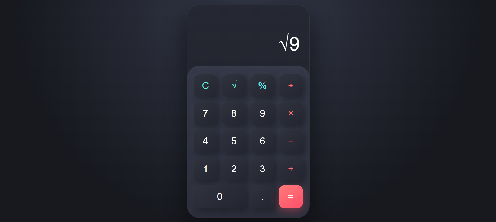

# 🧮 Calculator App

A simple and responsive calculator built using HTML, CSS, and JavaScript. This project performs basic arithmetic operations through a clean and modern user interface.

## 🚀 Features

- Addition (+)
- Subtraction (-)
- Multiplication (×)
- Division (÷)
- Percentage (%)
- Square Root (√)
- Clear Screen (C)
- Responsive Design
- Modern Dark Theme
- Smooth Button Animations

## 📸 Screenshot



> Replace the image path with your actual screenshot filename.

## 🛠️ Technologies Used

- HTML5
- CSS3
- JavaScript

## 📂 Project Structure

```bash
calculator/
│
├── index.html
├── style.css
├── script.js
├── assets/
│   └── calculator-preview.png
└── README.md
```

## ⚙️ Getting Started

Clone the repository:

```bash
git clone https://github.com/devwithvinay/calculator.git
```

Navigate to the project folder:

```bash
cd calculator
```

Open `index.html` in your browser.

## 🎯 What I Learned

- DOM Manipulation
- Event Handling
- JavaScript Functions
- CSS Grid Layout
- Responsive Design
- UI Development


## 👨‍💻 Author

**Vinay Kumar**

GitHub: https://github.com/devwithvinay

LinkedIn: https://www.linkedin.com/in/vinay-kumar-38357233a/

## ⭐ 

If you like this project, consider giving it a ⭐ on GitHub.
